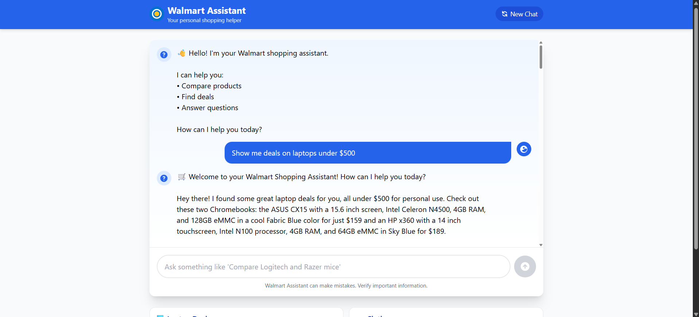
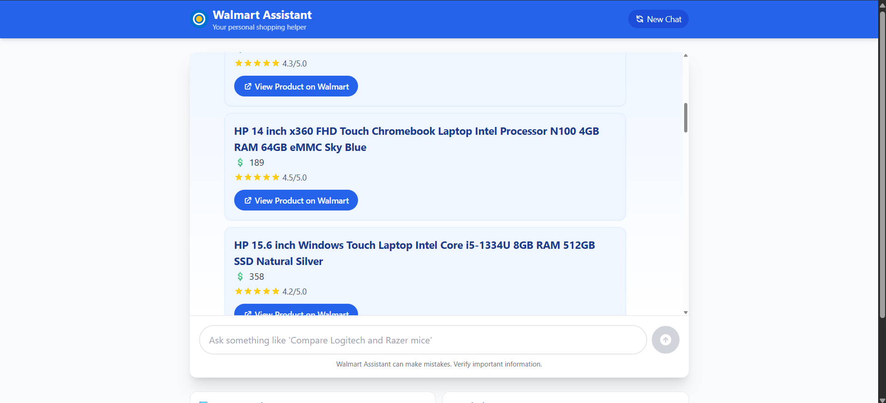
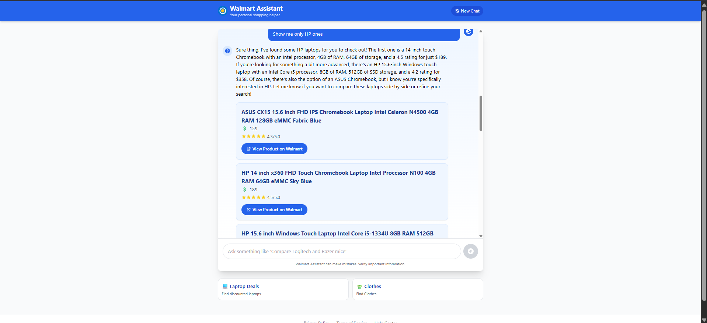
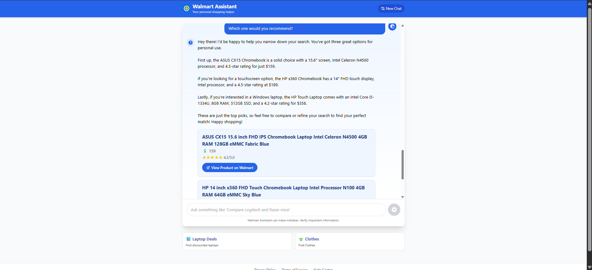

# 🛒 Wally - Your Walmart AI Shopping Assistant

 


## 🚀 Overview

The Walmart AI Shopping Assistant is a conversational commerce platform that transforms natural language queries into personalized shopping experiences. Combining Mistral AI's NLP capabilities with real-time Walmart product data, it delivers:

- **Intent-aware product discovery**
- **Contextual conversation memory**
- **Personalized recommendations**
- **Multi-interface access** (CLI + Web UI)

## ✨ Key Features

### 🧠 AI Core
- **Natural language understanding** for shopping queries
- **Intent extraction** (search/compare/refine/sort)
- **Tone adaptation** (casual/professional/enthusiastic)
- **Context-aware conversation memory**

### 🛍️ Shopping Capabilities
- **Smart product search** with filters (brand/price/features)
- **Side-by-side product comparison**
- **Personalized recommendations** based on preferences
- **"Which is best?"** decision engine
- **Like/Dislike learning system**

### 🔌 Integration
- **Real-time Walmart product data** via SerpAPI
- **Mistral AI API integration** for NLP
- **FastAPI backend** with React frontend

## 🏗️ Technical Architecture

### AI Layer
- **Mistral AI** for natural language processing
- **Custom intent extraction** pipeline
- **Conversation memory** system
- **Preference learning** algorithms

### Backend (Python)
- **FastAPI** RESTful endpoints
- **Custom state management** (ChatMemory class)
- **SerpAPI integration** for Walmart search
- **Mistral client** integration

### Frontend (React)
- **Interactive chat interface**
- **Product card components**
- **Filter controls**
- **Responsive design**

## 📦 Installation & Setup

### Prerequisites
- Python 3.10+
- Node.js 18+
- [Mistral API key](https://console.mistral.ai/)
- [SerpAPI key](https://serpapi.com/)

### Backend Setup
```bash
git clone https://github.com/yourrepo/walmart-ai-shopping.git
cd walmart-ai-shopping/backend

# Install dependencies
pip install -r requirements.txt

# Configure environment
cp .env.example .env
# Add your API keys to .env
```


### Frontend Setup
```
cd ../frontend
npm install
npm run dev
```

## 🖥️ Running the System

```
# Terminal 1 - Start backend
cd backend
uvicorn main:app --reload

# Terminal 2 - Start frontend
cd ../frontend
npm run dev
```


### Backend : http://127.0.0.1:8000
### Frontend : http://localhost:5173/

### CLI Version
```
cd backend
python assistant.py
```

## 🎛️ System Components

### Core Modules
File       | Purpose            |
|-----------------|--------------------------|
| **assistant.py**   | Main conversation loop               |
| **chat_memory.py**     | State management         |
| **filter_extraction.py**    | 	NLP intent parsing     |
| **recommender.py** | 	Product scoring       |
| **walmart_search.py** | Uses SerpAPI to extract products|
|**reply_generator.py** | For Natural Language replies |

## 🛠️ Technology Stack

### AI & Backend

- Mistral AI for NLP
- Python 3.10 with FastAPI
- SerpAPI for Walmart search
- Custom memory system

### Frontend

- **React.js with Vite**
- **Tailwind CSS**
- **Axios for API calls**
- **React hooks for state**


## 🚀 Future Roadmap

- **Voice interface integration**
- **Visual search capability**
- **Wishlist/sharing features**
- **Advanced price tracking**


## 👥 Team

- Team **Wally** - Developed for **Walmart Sparkathon 2025**

### Team Members
- **Padmesh Shukla**
- **Kartik Mahnot**
- **Asit Yadav**


## Images











## Wally - Making your shopping easier!!!
